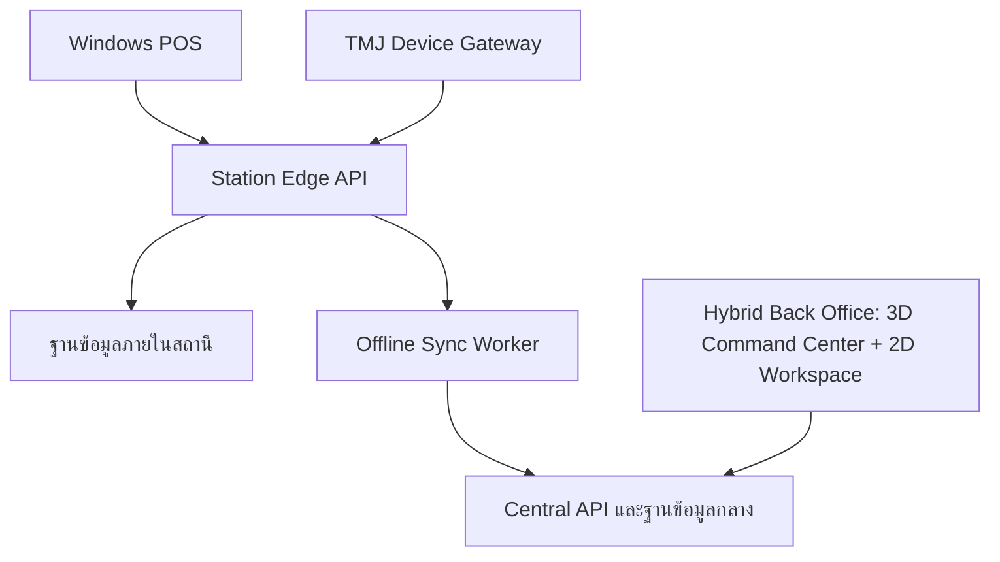

# แผนพัฒนาระบบ POS ปั๊มน้ำมันและสถานี 3D

**โครงการ:** ระบบบริหารปั๊มน้ำมันกลางใหญ่บริการแบบครบวงจร  
**เอกสาร:** Development Plan  
**เวอร์ชัน:** 1.2  
**วันที่จัดทำ:** 16 กรกฎาคม 2026  
**สถานะ:** รออนุมัติแผนก่อนเริ่มพัฒนา

---

## 1. เป้าหมายโครงการ

พัฒนาระบบเดียวที่ครอบคลุมการขายหน้าลาน การออกเอกสารภาษี การตัดกะ การบริหารหลังบ้าน และการดูสถานีผ่านภาพ 3D โดยมีเป้าหมายสำคัญดังนี้

1. POS ต้องขายและออกเอกสารได้แม้อินเทอร์เน็ตภายนอกขัดข้อง
2. รองรับตู้จ่าย 4 ตู้ ตู้ละ 2 หัวจ่าย รวม 8 หัวจ่าย
3. รองรับน้ำมันดีเซล B7, แก๊สโซฮอล์ 95 และแก๊สโซฮอล์ 91
4. รองรับใบเสร็จ ใบกำกับภาษีเต็มรูป และการจัดการลูกค้านิติบุคคล
5. มีระบบเปิดกะ ปิดกะ ตรวจเงิน และสรุปยอดแยกพนักงาน/หัวจ่าย/ชนิดน้ำมัน
6. มี Back Office สำหรับราคา สต็อก ถังน้ำมัน ผู้ใช้ รายงาน และการตรวจสอบย้อนหลัง
7. มีเว็บ 3D แสดงสถานะสถานี ตู้จ่าย หัวจ่าย ยอดขาย และการแจ้งเตือน
8. ติดตั้ง POS แบบ Native บน Windows 11 ส่วนบริการเซิร์ฟเวอร์และเว็บรันด้วย Docker
9. เตรียมโครงสร้างสำหรับเชื่อมต่ออุปกรณ์ TMJ RT-TG224 หลังยืนยันโปรโตคอลจริง

## 2. ขอบเขตระบบ

### 2.1 Windows POS

- เข้าสู่ระบบและเลือกกะ
- แสดงตู้จ่ายและหัวจ่ายแบบเห็นสถานะชัดเจน
- รับรายการเติมน้ำมันจากตู้จ่ายหรือบันทึกผ่านโหมดสำรองที่ได้รับสิทธิ์
- ขายสินค้าในร้านด้วยบาร์โค้ด
- รับชำระเงินสด โอน/QR บัตร และเครดิตลูกค้า ตามช่องทางที่อนุมัติ
- พิมพ์ใบเสร็จอย่างย่อและใบกำกับภาษีเต็มรูป
- ค้นหาและพิมพ์เอกสารซ้ำโดยมีประวัติการพิมพ์
- ยกเลิก คืนสินค้า และแก้ไขรายการผ่านสิทธิ์อนุมัติ
- เปิดลิ้นชัก เก็บเงินเข้า/เบิกเงินออก และตรวจนับเงิน
- เปิดกะ ปิดกะ และพิมพ์สรุปกะ
- เก็บธุรกรรมไว้ภายในสถานีระหว่างอินเทอร์เน็ตขัดข้อง และซิงก์เมื่อกลับมา

### 2.2 Back Office

- ใช้หน้าจอ 2D เป็น Workspace หลักสำหรับตาราง แบบฟอร์ม รายงาน การค้นหา และ Approval
- Dashboard ยอดขายรายวัน รายกะ รายหัวจ่าย และรายชนิดน้ำมัน
- จัดการผู้ใช้ บทบาท และสิทธิ์อนุมัติ
- จัดการสถานี ตู้จ่าย หัวจ่าย ถัง และชนิดน้ำมัน
- จัดการราคาน้ำมัน พร้อมเวลาเริ่มใช้และประวัติการเปลี่ยนราคา
- จัดการสินค้า หน่วยนับ บาร์โค้ด ต้นทุน และสต็อก
- รับน้ำมันเข้า วัดถัง บันทึกยอดยกมา/ยกไป และตรวจส่วนต่าง
- จัดการลูกค้า ข้อมูลสำหรับออกเอกสารภาษี และวงเงินเครดิต
- รายงานยอดขาย ภาษี การชำระเงิน เงินสด สต็อก กะ และส่วนต่างน้ำมัน
- Export รายงานเป็น Excel/PDF ในระยะที่กำหนด
- Audit Log สำหรับการแก้ราคา ยกเลิกเอกสาร ปรับสต็อก และเปลี่ยนสิทธิ์

### 2.3 Hybrid Command Center 3D + 2D

- ใช้ 3D เป็น Command Center แสดงโมเดลสถานี อาคารสำนักงาน ตู้จ่าย 4 ตู้ หัวจ่าย 8 หัว ถัง คลัง และพื้นที่ปฏิบัติงาน
- แบ่งพื้นที่คลิกได้ เช่น หน้าลาน ห้องควบคุม บัญชี คลังสินค้า ซ่อมบำรุง และห้องผู้จัดการ
- ใช้สี ป้าย และ Badge แสดงชนิดน้ำมัน สถานะ KPI และระดับความรุนแรงของ Alert
- เมื่อเลือกพื้นที่หรืออุปกรณ์ ให้เปิดแผง 2D ที่มีรายละเอียด ตาราง กราฟ หรือแบบฟอร์ม โดยคงบริบทของรายการเดิม
- ผู้ใช้สลับ 3D/2D ได้ตลอดเวลาโดยคงสาขา ช่วงเวลา ตัวกรอง และรายการที่เลือก
- 3D และ 2D ใช้ API, Realtime State, Permission และ Business Rule ชุดเดียวกัน
- งานแก้ไขข้อมูล การเงิน ราคา สต็อก และ Approval ต้องทำผ่านหน้าจอ 2D ที่ตรวจสอบข้อมูลและยืนยันได้ชัดเจน
- รุ่นแรกให้ 3D เป็น Read-only; คำสั่งที่มีผลต่ออุปกรณ์จริงต้องผ่านการออกแบบความปลอดภัยและ Site Acceptance Test แยกต่างหาก
- มี 2D fallback อัตโนมัติและปุ่มเลือกโหมดสำหรับเครื่องที่ไม่รองรับ WebGL, เครื่องประสิทธิภาพต่ำ หรือผู้ใช้ต้องการลด Animation
- ความขัดข้องของ 3D ต้องไม่กระทบ POS, Back Office 2D หรือการรับ Alert สำคัญ

### 2.4 การเชื่อมต่ออุปกรณ์

- TMJ RT-TG224 ผ่านช่องทางที่ตรวจพบจริง เช่น Serial, RS-485 หรือ TCP/IP
- เครื่องพิมพ์ใบเสร็จ 80 มม.
- เครื่องพิมพ์ใบกำกับภาษีตามแบบเอกสารที่อนุมัติ
- เครื่องอ่านบาร์โค้ด ลิ้นชักเก็บเงิน และจอแสดงผลลูกค้า หากมี
- UPS และแผนกู้คืนหลังไฟดับสำหรับเครื่อง POS/Station Server

## 3. สถาปัตยกรรมที่เสนอ



### หลักการออกแบบ

- **Offline-first:** การขายอาศัย Station Edge ภายในปั๊ม ไม่ผูกกับอินเทอร์เน็ตภายนอก
- **แยกงานสำคัญ:** POS, การสื่อสารตู้จ่าย, เซิร์ฟเวอร์ และเว็บ 3D แยกโมดูลกัน ความขัดข้องของ 3D ต้องไม่หยุดการขาย
- **Outbox/Inbox Sync:** ทุกธุรกรรมมีรหัสไม่ซ้ำ ส่งซ้ำได้โดยไม่สร้างยอดซ้ำ และมีคิวรอซิงก์
- **Auditability:** การเปลี่ยนแปลงสำคัญบันทึกผู้ทำ เวลา เครื่อง และเหตุผล
- **Device Abstraction:** โปรแกรมหลักไม่ผูกกับคำสั่งเฉพาะ TMJ โดยตรง จึงสร้าง Simulator และเปลี่ยนไดรเวอร์ได้
- **Least Privilege:** แบ่งสิทธิ์พนักงานขาย หัวหน้ากะ ผู้จัดการ บัญชี และผู้ดูแลระบบ
- **Hybrid UI:** 3D ใช้สำรวจสถานะและบริบท ส่วน 2D ใช้ทำงานที่ต้องอ่าน กรอก ตรวจสอบ และอนุมัติ โดยใช้ข้อมูลและสิทธิ์ชุดเดียวกัน

### ขอบเขตของ Docker

| ส่วนประกอบ | วิธีติดตั้ง | เหตุผล |
|---|---|---|
| Windows POS | ติดตั้งบน Windows 11 ด้วย Installer | ต้องใช้งาน UI และอุปกรณ์หน้าร้านโดยตรง |
| TMJ Device Gateway | Windows Service เป็นค่าเริ่มต้น | เข้าถึง Serial/ไดรเวอร์ได้เสถียรกว่า |
| Station API, Sync Worker, Database | Docker Compose ภายในสถานี | สำรอง กู้คืน และอัปเดตได้เป็นชุด |
| Central API, Database, Web 3D, Back Office | Docker Compose บนเซิร์ฟเวอร์ | บริหารและขยายระบบได้ง่าย |

## 4. เทคโนโลยีหลัก

| ชั้นระบบ | เทคโนโลยีที่เสนอ |
|---|---|
| Desktop POS | C#, WPF, MVVM บน .NET 10 LTS |
| Device Gateway | .NET Worker Service/Windows Service |
| API | ASP.NET Core Web API |
| Data Access | Entity Framework Core และ SQL แบบควบคุมได้สำหรับรายงาน |
| Database | PostgreSQL เป็นค่าเริ่มต้น หรือ SQL Server หากมีเงื่อนไขเดิมขององค์กร |
| Web Back Office | React + TypeScript, Routing และ State ร่วมระหว่างมุมมอง 2D/3D |
| 3D | Three.js หรือ React Three Fiber, โมเดล glTF/GLB |
| Realtime | SignalR ภายในระบบ โดยมีการ reconnect และ fallback |
| Container | Docker Compose, Linux containers สำหรับบริการเซิร์ฟเวอร์ |
| Logging/Monitoring | Structured logging, health checks และ OpenTelemetry |
| Test | xUnit, integration tests, Playwright และ Device Simulator |

> หมายเหตุ: เลือก .NET 10 เพราะเป็น LTS ณ วันที่จัดทำแผน ส่วน WPF เหมาะกับโปรแกรม Desktop บน Windows และ ASP.NET Core รองรับการทำ Container อย่างเป็นทางการ

## 5. โมดูลและลำดับความสำคัญ

| โมดูล | MVP | รุ่นเต็ม |
|---|:---:|:---:|
| ผู้ใช้ บทบาท และสิทธิ์ | ✓ | ✓ |
| ตั้งค่าสถานี ตู้จ่าย หัวจ่าย และน้ำมัน | ✓ | ✓ |
| เปิดกะ/ปิดกะ/เงินสด | ✓ | ✓ |
| ขายน้ำมันและสินค้า | ✓ | ✓ |
| ใบเสร็จและใบกำกับภาษีเต็มรูป | ✓ | ✓ |
| เครื่องพิมพ์/ลิ้นชัก/บาร์โค้ด | ✓ | ✓ |
| Offline Queue และ Sync | ✓ | ✓ |
| TMJ Simulator | ✓ | ✓ |
| เชื่อม TMJ จริง | เมื่อผ่าน Phase 0 | ✓ |
| Dashboard และรายงานหลัก | ✓ | ✓ |
| ราคาและสต็อกน้ำมัน | ✓ | ✓ |
| สต็อกสินค้าร้าน | พื้นฐาน | ✓ |
| ลูกค้าเครดิต/ลูกหนี้ | - | ✓ |
| 3D สถานะตู้จ่าย | ต้นแบบ/Read-only | ✓ |
| ระดับถังและแจ้งเตือน 3D | - | ✓ |
| เชื่อมระบบบัญชีภายนอก | - | ระยะต่อยอด |

## 6. แบบจำลองข้อมูลหลัก

- **Station:** สถานี จุดขาย เครื่อง POS และการตั้งค่าท้องถิ่น
- **Dispenser:** ตู้จ่าย รุ่น ช่องทางสื่อสาร และสถานะ
- **Nozzle:** หัวจ่าย เลขมิเตอร์ ชนิดน้ำมัน และถังต้นทาง
- **FuelProduct/FuelPrice:** ชนิดน้ำมัน หน่วย ราคา และช่วงเวลาที่มีผล
- **Tank/TankReading/FuelDelivery:** ถัง การวัดระดับ และการรับน้ำมันเข้า
- **Shift/CashMovement:** กะ ผู้รับผิดชอบ เงินตั้งต้น เงินเข้าออก และยอดปิด
- **Sale/SaleItem/Payment:** การขาย รายการ และช่องทางชำระเงิน
- **TaxDocument/DocumentSequence:** เอกสารภาษี เลขที่เอกสาร สถานะ และการพิมพ์ซ้ำ
- **Customer/TaxProfile:** ลูกค้า สาขา ที่อยู่ และข้อมูลออกเอกสาร
- **Product/InventoryMovement:** สินค้า บาร์โค้ด ต้นทุน และการเคลื่อนไหวสต็อก
- **DeviceEvent/DeviceCommand:** เหตุการณ์และคำสั่งระหว่าง Gateway กับระบบ
- **Outbox/Inbox/SyncCheckpoint:** คิวซิงก์ การป้องกันข้อมูลซ้ำ และจุดตรวจสอบ
- **User/Role/Permission/AuditLog:** ผู้ใช้ สิทธิ์ และประวัติการเปลี่ยนแปลง

## 7. แผนพัฒนาเป็นระยะ

### Phase 0 — สำรวจหน้างานและยืนยันข้อกำหนด (1–2 สัปดาห์)

**งานหลัก**

- สำรวจเครื่อง POS, ระบบเครือข่าย, เครื่องพิมพ์, ลิ้นชัก และ UPS
- บันทึก Serial/รุ่น/พอร์ตของตู้ TMJ และอุปกรณ์ควบคุม
- ขอคู่มือโปรโตคอล SDK หรือโปรแกรมทดสอบจากผู้ขาย
- ตรวจรูปแบบข้อมูลของตู้ด้วยวิธีอ่านอย่างปลอดภัย โดยไม่สั่งจ่ายจริงก่อนอนุมัติ
- สรุปขั้นตอนขาย รับเงิน เปิด/ปิดกะ ยกเลิก และพิมพ์เอกสาร
- ตรวจแบบใบเสร็จ/ใบกำกับภาษีตัวอย่างร่วมกับผู้ใช้และผู้รับผิดชอบด้านบัญชี
- ยืนยันจำนวนเครื่อง POS ผู้ใช้งานพร้อมกัน และช่องทางชำระเงิน

**ผลส่งมอบ**

- Requirement Specification
- ผังอุปกรณ์และเครือข่าย
- TMJ Integration Report และ Protocol Decision
- แบบเอกสารที่อนุมัติ
- รายการ Acceptance Criteria ฉบับยืนยัน

**เงื่อนไขผ่าน Phase**

- ระบุวิธีเชื่อม TMJ ได้ หรืออนุมัติให้เริ่มด้วย Simulator/Manual Fallback
- ผู้ใช้งานอนุมัติขั้นตอนขาย กะ และเอกสาร

### Phase 1 — UX/UI และต้นแบบ 3D (2 สัปดาห์)

**งานหลัก**

- Wireframe หน้าขาย หน้าตู้จ่าย ชำระเงิน ใบกำกับภาษี และปิดกะ
- Wireframe Back Office และรายงานหลัก
- ออกแบบ Information Architecture และเส้นทางจากพื้นที่ 3D ไปยัง 2D Workspace
- สร้างต้นแบบสถานี 3D ที่มี 4 ตู้/8 หัว และข้อมูลจำลอง
- สร้างต้นแบบอาคารสำนักงานและพื้นที่คลิกได้ตามบทบาท
- ออกแบบการสลับโหมดโดยคง Context, Filter และ Selection
- ทดสอบขนาดตัวอักษร ความชัดเจน และการใช้งานบนจอ POS
- ทดสอบ Keyboard Navigation, Reduced Motion และกรณี WebGL ใช้งานไม่ได้
- จัดทำ Design System สี สถานะ ไอคอน และข้อความภาษาไทย

**ผลส่งมอบ**

- Prototype ที่กดทดลองได้
- แบบหน้าจอที่ผู้ใช้อนุมัติ
- User Flow ของ 3D Command Center และ 2D Workspace ที่ผู้ใช้อนุมัติ
- 3D Performance Budget และแนวทางโหมด 2D สำรอง

### Phase 2 — โครงสร้างระบบและฐานข้อมูล (2 สัปดาห์)

**งานหลัก**

- ตั้งค่า Solution/Repository ตาม Clean Architecture แบบไม่ซับซ้อนเกินจำเป็น
- สร้างฐานข้อมูล Migration, Seed Data และ Master Data ของสถานี
- สร้าง Authentication, Role/Permission และ Audit Log
- ตั้งค่า Station API, Central API, Sync Worker และ Docker Compose
- ตั้งค่า Logging, Health Check, Error Handling และ CI
- สร้าง Device Simulator สำหรับ 4 ตู้ 8 หัว

**เงื่อนไขผ่าน Phase**

- นักพัฒนาสามารถเปิดระบบทั้งชุดด้วยขั้นตอนมาตรฐาน
- Login, สิทธิ์, Migration, Backup ขั้นต้น และ Simulator ทำงานได้

### Phase 3 — POS และเอกสารขาย MVP (3–4 สัปดาห์)

**งานหลัก**

- เปิดกะ/ปิดกะและจัดการเงินสด
- แสดงสถานะหัวจ่าย รับรายการ และสร้างการขาย
- ขายสินค้า บาร์โค้ด ส่วนลดตามสิทธิ์ และหลายช่องทางชำระเงิน
- ใบเสร็จ ใบกำกับภาษีเต็มรูป ค้นหา และพิมพ์ซ้ำ
- ยกเลิก/คืนรายการด้วย Approval Flow
- Printer Service และ Hardware Abstraction
- ทดสอบขายโดยตัดอินเทอร์เน็ตภายนอก

**เงื่อนไขผ่าน Phase**

- ทำเส้นทางขายหลักตั้งแต่เปิดกะจนปิดกะได้ครบ
- ยอดขาย การชำระเงิน เอกสาร และเงินปิดกะตรวจสอบย้อนกลับได้

### Phase 4 — เชื่อมตู้จ่าย TMJ (3–5 สัปดาห์ ขึ้นกับข้อมูลผู้ผลิต)

**งานหลัก**

- พัฒนา TMJ Driver ตามโปรโตคอลที่ยืนยัน
- Map ตู้/หัว/ชนิดน้ำมันกับข้อมูลจริง
- จัดการ reconnect, timeout, checksum, duplicate event และ sequence
- เปรียบเทียบมิเตอร์ก่อน–หลังกับยอดรายการ
- ทดสอบกับ Simulator ก่อนทดสอบหน้างาน
- ทดสอบ Fail-safe และ Manual Fallback ที่ต้องใช้สิทธิ์

**เงื่อนไขผ่าน Phase**

- อ่านสถานะและยอดจากหัวจ่ายจริงได้ถูกต้องทุกหัว
- การหลุดสาย/รีสตาร์ตไม่ทำให้รายการหายหรือซ้ำ
- ผ่าน Site Acceptance Test โดยไม่กระทบการขายจริง

### Phase 5 — Back Office, สต็อก และรายงาน (3 สัปดาห์)

**งานหลัก**

- Dashboard ยอดขาย/ลิตร/ช่องทางชำระเงิน/กะ
- จัดการราคาโดยกำหนดเวลามีผลและเก็บประวัติ
- รับน้ำมันเข้า วัดถัง และตรวจส่วนต่างเบื้องต้น
- สต็อกสินค้า รับเข้า โอน ปรับ และตรวจนับ
- รายงานภาษีและรายงานบริหารตามแบบที่อนุมัติ
- Export และกำหนดสิทธิ์การเห็นข้อมูล
- สร้าง 2D Workspace สำหรับตาราง แบบฟอร์ม รายงาน และ Approval
- รองรับ Deep Link จากสถานี/พื้นที่/อุปกรณ์ใน 3D เข้าหน้า 2D ที่ตรงกัน

### Phase 6 — Hybrid Command Center รุ่นใช้งาน (2–3 สัปดาห์)

**งานหลัก**

- สร้างโมเดลสถานีและอาคารสำนักงานจากผัง/ภาพอ้างอิง
- เชื่อมข้อมูล Realtime จาก API
- สร้างพื้นที่คลิกได้และ Map กับ Route/Entity ใน 2D Workspace
- คลิกดูตู้ หัวจ่าย ถัง คลัง ยอดล่าสุด KPI และเหตุการณ์ผิดปกติ
- สร้าง 2D Detail Panel/Drawer และรองรับ Deep Link โดยคง Context
- เพิ่มตัวสลับโหมด 3D/2D พร้อมบันทึกความต้องการของผู้ใช้
- ลดรายละเอียดโมเดลตามสมรรถนะเครื่องและโทรศัพท์
- เพิ่ม Automatic 2D Fallback, Reduced Motion และทดสอบเบราว์เซอร์หลัก
- ตรวจ Permission Parity และ Data Parity ระหว่างสองโหมด

### Phase 7 — Offline Sync, ความปลอดภัย และการกู้คืน (2 สัปดาห์)

**งานหลัก**

- ทดสอบอินเทอร์เน็ตขาดอย่างน้อย 24 ชั่วโมงตามสถานการณ์จำลอง
- ทดสอบส่งข้อมูลค้างกลับส่วนกลางโดยไม่ซ้ำ
- กำหนดกฎแก้ Conflict ของราคา ลูกค้า และข้อมูลอ้างอิง
- ทำ Backup/Restore Drill และ Recovery Runbook
- ตรวจสิทธิ์ Secrets, TLS/VPN, Session และ Audit Log
- ทดสอบไฟดับ/โปรเซสล่ม/ฐานข้อมูลรีสตาร์ตในสภาพแวดล้อมทดสอบ

### Phase 8 — UAT, Pilot และเปิดใช้งานจริง (2–3 สัปดาห์)

**งานหลัก**

- ทดสอบ UAT ตามบทบาทพนักงานขาย หัวหน้ากะ ผู้จัดการ และบัญชี
- ติดตั้ง Pilot 1 จุดขายและเฝ้าดู 3–7 วันทำการ
- เปรียบเทียบยอด POS กับมิเตอร์ เงินสด และเอกสารเดิม
- แก้ข้อบกพร่องที่มีผลต่อยอดเงิน/ข้อมูลก่อน Go-live
- อบรมผู้ใช้ จัดทำคู่มือ และแผนย้อนกลับ
- เปิดใช้งานจริงและติดตามช่วง Hypercare

## 8. กรอบเวลาโดยประมาณ

| เป้าหมาย | ระยะเวลาโดยประมาณ |
|---|---:|
| Prototype หน้าจอและสถานี 3D | 2–4 สัปดาห์ |
| POS MVP พร้อม Simulator และ Offline | 10–14 สัปดาห์ |
| Pilot เชื่อม TMJ จริง | 14–20 สัปดาห์ |
| ระบบเต็มพร้อม Back Office และ 3D | 20–26 สัปดาห์ |

ระยะเวลานี้เป็นกรอบเบื้องต้น งานบาง Phase ทำคู่ขนานได้เมื่อทราบขนาดทีม แต่ Phase เชื่อม TMJ อาจเปลี่ยนตามความพร้อมของคู่มือ อุปกรณ์ทดสอบ และผู้ผลิต

## 9. เกณฑ์ยอมรับระบบหลัก

| รหัส | เกณฑ์ยอมรับ |
|---|---|
| AC-01 | อินเทอร์เน็ตภายนอกขัดข้องแล้วยังขาย รับเงิน และพิมพ์เอกสารได้ |
| AC-02 | เมื่ออินเทอร์เน็ตกลับมา ข้อมูลค้างซิงก์ครบโดยไม่สร้างยอดซ้ำ |
| AC-03 | ตู้ 4 ตู้/หัวจ่าย 8 หัวถูก Map กับชนิดน้ำมันและสถานะจริง |
| AC-04 | ยอดลิตร × ราคาที่มีผลตรงกับยอดขายภายใต้กฎการปัดเศษที่อนุมัติ |
| AC-05 | ใบเสร็จและใบกำกับภาษีตรงกับแบบที่อนุมัติ และตรวจประวัติการพิมพ์ได้ |
| AC-06 | ยอดปิดกะกระทบยอดกับการขาย การชำระเงิน และเงินสดได้ |
| AC-07 | รายการยกเลิก คืนเงิน เปลี่ยนราคา และปรับสต็อกมีผู้อนุมัติและ Audit Log |
| AC-08 | การหลุดการเชื่อมต่อกับตู้จ่ายไม่ทำให้ธุรกรรมหายหรือซ้ำ |
| AC-09 | 3D แสดงสถานะถูกต้อง และหาก 3D ใช้ไม่ได้ POS กับ Back Office 2D ยังทำงานตามปกติ |
| AC-10 | Backup ที่กำหนดสามารถ Restore ในเครื่องทดสอบได้จริง |

## 10. ข้อกำหนดที่ไม่ใช่ฟังก์ชัน

- หน้าขายหลักตอบสนองเร็วและใช้คีย์บอร์ด/ทัชสกรีนได้
- ปุ่มและตัวอักษรสำคัญต้องอ่านชัดบนจอ POS ตามขนาดจอจริง
- ทุกธุรกรรมทางการเงินใช้เลขรหัสไม่ซ้ำและบันทึกแบบ Atomic
- การส่งข้อมูลซ้ำต้องไม่ทำให้ยอดขาย เอกสาร หรือสต็อกซ้ำ
- 3D ต้องโหลดแบบ Progressive และไม่โหลดทรัพยากรเกินความจำเป็น
- รหัสผ่านจัดเก็บด้วย Password Hash ที่เหมาะสม และ Secrets ไม่อยู่ใน Source Code
- แบ่งสิทธิ์ตามบทบาท พร้อมบันทึก Session และเหตุการณ์สำคัญ
- เก็บเวลาโดยมี Station Time Zone ชัดเจน และซิงก์นาฬิกาเครื่อง
- การอัปเดตระบบต้องมี Version, Migration Plan และ Rollback Plan
- นโยบายเก็บข้อมูล เอกสารภาษี และข้อมูลส่วนบุคคลต้องได้รับการตรวจยืนยันตามข้อกำหนดปัจจุบันก่อน Go-live

## 11. ความเสี่ยงและแนวทางลดความเสี่ยง

| ความเสี่ยง | ระดับ | แนวทาง |
|---|:---:|---|
| ไม่มีคู่มือโปรโตคอล TMJ หรือรุ่นหน้างานต่างจากที่ระบุ | สูง | ขอข้อมูลผู้ขายตั้งแต่ Phase 0, สร้าง Simulator และเตรียม Manual Fallback |
| ทดสอบกับตู้จริงไม่ได้ต่อเนื่อง | สูง | จัด Test Window, Capture ข้อมูลแบบ Read-only และใช้ Hardware-in-the-loop |
| รายการซ้ำ/หายหลังเครือข่ายหลุด | สูง | Transaction ID, Outbox/Inbox, Idempotency และทดสอบ Fault Injection |
| รูปแบบเอกสารหรือกฎบัญชีไม่ตรงการใช้งานจริง | สูง | อนุมัติแบบเอกสารและกฎเลขที่ก่อนพัฒนา พร้อม UAT โดยผู้รับผิดชอบ |
| ไฟดับกระทันหัน | สูง | UPS, Atomic Transaction, Auto Recovery และทดสอบ Restore |
| โมเดล 3D หนักบนโทรศัพท์ | กลาง | ลด Polygon/Texture, Lazy Load และมีโหมด 2D |
| ไดรเวอร์เครื่องพิมพ์แตกต่างกัน | กลาง | Printer Adapter, รายการรุ่นที่รองรับ และทดสอบเครื่องจริง |
| ผู้ใช้แก้ราคา/ยกเลิกโดยไม่มีอำนาจ | สูง | RBAC, Approval Flow, Audit Log และแจ้งเตือน |

## 12. โครงสร้าง Source Code ที่เสนอ

```text
src/
  Desktop/PetrolPOS/
  DeviceGateway/TmjGateway/
  Services/StationApi/
  Services/CentralApi/
  Services/SyncWorker/
  Web/BackOffice/
  Web/Station3D/
  BuildingBlocks/
tests/
  UnitTests/
  IntegrationTests/
  DeviceSimulator/
  EndToEndTests/
deploy/
  station-docker/
  central-docker/
  windows-installer/
docs/
  architecture/
  operations/
  user-guides/
```

## 13. สิ่งส่งมอบเมื่อระบบเสร็จ

- Source Code พร้อมประวัติเวอร์ชัน
- Windows 11 Installer สำหรับ POS และ Device Gateway
- Docker Compose สำหรับ Station Server และ Central Server
- Database Schema, Migration และ Seed Data
- TMJ Simulator และ Driver ที่ผ่านการทดสอบ
- แบบใบเสร็จ/ใบกำกับภาษีที่อนุมัติ
- ชุด Automated Tests และผล UAT/SAT
- คู่มือติดตั้ง สำรอง กู้คืน อัปเดต และแก้เหตุขัดข้อง
- คู่มือพนักงานขาย หัวหน้ากะ ผู้จัดการ และผู้ดูแลระบบ
- รายการบัญชีผู้ใช้/สิทธิ์เริ่มต้นและ Checklist เปิดใช้งานจริง

## 14. ข้อมูลที่ต้องยืนยันก่อนเริ่มเขียน Production Code

1. พอร์ตและโปรโตคอลจริงของ TMJ RT-TG224 รวมถึงคู่มือหรือ SDK
2. จำนวนเครื่อง POS และจำนวนพนักงานที่ใช้งานพร้อมกัน
3. รุ่นเครื่องพิมพ์ ขนาดกระดาษ ลิ้นชัก และอุปกรณ์ต่อพ่วง
4. ช่องทางชำระเงินที่ต้องรองรับในรุ่นแรก
5. รูปแบบเลขที่เอกสาร สาขา และแบบใบกำกับภาษีฉบับอนุมัติ
6. วิธีวัดถัง/รับน้ำมันเข้า และแหล่งข้อมูลราคา
7. ตำแหน่ง Station Server, Central Server และวิธีเข้าจากภายนอกอย่างปลอดภัย
8. ผังหรือภาพอ้างอิงสำหรับสร้างโมเดลสถานี 3D
9. ผู้มีอำนาจอนุมัติราคา ยกเลิก คืนเงิน และปรับสต็อก
10. ขอบเขตการเชื่อมระบบบัญชีหรือระบบอื่นในอนาคต

## 15. Definition of Done

งานหนึ่งรายการถือว่าเสร็จเมื่อ

- ผ่าน Acceptance Criteria ของรายการนั้น
- มี Unit/Integration Test ตามความเสี่ยง
- ผ่าน Code Review และไม่มีข้อผิดพลาดระดับร้ายแรงค้างอยู่
- มี Logging และข้อความผิดพลาดที่ผู้ใช้เข้าใจได้
- อัปเดต Migration/Configuration/คู่มือที่เกี่ยวข้องแล้ว
- ผ่านการทดสอบ Offline หรือ Device Failure หากเกี่ยวข้อง
- ผู้รับผิดชอบธุรกิจอนุมัติหน้าจอ เอกสาร หรือรายงานที่เกี่ยวข้อง

## 16. ขั้นตอนถัดไปหลังอนุมัติแผน

- [ ] นัดสำรวจ Phase 0 และจัดทำ Hardware Checklist
- [ ] รวบรวมคู่มือ/ภาพพอร์ต/โปรแกรมเดิมของ TMJ RT-TG224
- [ ] ยืนยันแบบใบเสร็จและใบกำกับภาษีจากตัวอย่างที่ได้รับ
- [ ] จัดทำผังสถานีและ Mapping 4 ตู้ 8 หัว
- [ ] สร้าง UX Prototype ของ POS และ Back Office
- [ ] สร้างต้นแบบสถานี 3D ด้วยข้อมูลจำลอง
- [ ] สรุป Architecture Decision Record และเริ่ม Phase 2

## 17. แผนขยายสู่ระบบบริหารสถานีครบวงจร

ขอบเขต Phase 0–8 ทำให้แกนหลักของสถานีขายและทำงานแบบ Offline ได้ แต่การบริหารให้ครบวงจรยังต้องมีวงจรจัดซื้อ–รับเข้า–ขาย–รับชำระ–กระทบยอด–บัญชี รวมถึงงานลูกค้า บุคลากร ทรัพย์สิน และการบริหารหลายสาขา โดยแบ่งลำดับเพื่อไม่ให้กระทบ MVP ดังนี้

### 17.1 งานควบคุมที่ต้องเพิ่มก่อน Pilot/Go-live

| ด้าน | ขอบเขตขั้นต่ำ |
|---|---|
| ปิดวันธุรกิจ | กำหนด Business Date, End-of-Day, Lock งวด และเปิดใหม่ด้วยสิทธิ์ |
| กระทบยอดการชำระเงิน | เงินสด, QR/โอน, EDC/บัตร, เครดิต และยอด Settlement จากผู้ให้บริการ |
| ควบคุมเงินสด | Cash Drop, Safe, เงินขาด/เกิน, เหตุผล และผู้อนุมัติ |
| Wet-stock Control | สต็อกตามบัญชีเทียบยอดวัดถัง/มิเตอร์ พร้อมค่าคลาดเคลื่อนและการแจ้งเตือน |
| Exception Management | Dashboard รายการค้างซิงก์, เอกสารผิดปกติ, ยอดไม่ลงตัว และอุปกรณ์ Offline |
| Data Migration/Cutover | นำเข้า Master Data, ยอดยกมา, ลูกหนี้, สต็อก และตรวจยอดก่อนเปิดระบบ |
| Operations | Monitoring, Alert, Support Matrix, RTO/RPO, Runbook และช่องทางแจ้งเหตุ |
| Performance | Load/Soak Test ตามจำนวน POS, ผู้ใช้, ธุรกรรม และระยะ Offline ที่ยืนยัน |

### 17.2 โมดูลสำหรับสถานีเดียวแบบครบวงจร

| โมดูล | ความสามารถหลัก | ลำดับ |
|---|---|:---:|
| จัดซื้อและผู้ขาย | Supplier, ใบขอซื้อ/PO, รับสินค้า, คืนผู้ขาย, ต้นทุน และเอกสารอ้างอิง | สูง |
| จัดซื้อน้ำมันและ Wet Stock | สั่งซื้อ, รับตามเที่ยว/ช่องรถ, เอกสารส่งมอบ, วัดถังก่อน–หลัง และส่วนต่าง | สูง |
| เจ้าหนี้/ส่งออกบัญชี | จับคู่ PO–รับเข้า–Invoice และส่งข้อมูลเข้าระบบบัญชี | สูง |
| ลูกหนี้และ Fleet | วงเงิน, เงื่อนไขเครดิต, รถ/คนขับ, Statement, รับชำระ และ Aging | สูง |
| สมาชิกและโปรโมชั่น | สมาชิก, คูปอง, แต้ม, Promotion Rule, Campaign และการป้องกันใช้สิทธิ์ซ้ำ | กลาง |
| บุคลากร | ตารางกะ, มอบหมายจุดขาย, เวลาเข้างาน, เป้าหมาย และผลการปฏิบัติงาน | กลาง |
| ทรัพย์สินและซ่อมบำรุง | Asset Register, PM, Work Order, Downtime, อะไหล่ และประวัติซ่อม | กลาง |
| ความปลอดภัยหน้างาน | Checklist, เหตุการณ์, การรั่วไหล, ใบรับรอง/การสอบเทียบ และงานแก้ไข | กลาง |

### 17.3 โมดูลสำนักงานใหญ่และหลายสาขา

- Master Data กลางสำหรับสินค้า น้ำมัน ราคา โปรโมชั่น ผู้ขาย และลูกค้า
- การกำหนดราคา/โปรโมชั่นล่วงหน้าและกระจายไปสาขาพร้อมสถานะตอบรับ
- Dashboard รวมหลายสาขา พร้อม Drill-down และการแยกสิทธิ์ข้อมูลตามสาขา
- เปรียบเทียบยอดขาย Margin, Stock Loss, Payment Variance และ KPI ระหว่างสาขา
- โอนสินค้าระหว่างสาขาและติดตามของระหว่างทาง
- บริหารผู้ใช้และสิทธิ์จากส่วนกลาง โดยสถานียังทำงานได้เมื่อส่วนกลางขัดข้อง
- Data Warehouse/BI และ API สำหรับระบบบัญชี ERP, Payment, CRM หรือ Data Platform
- ศูนย์แจ้งเตือนและมุมมองผู้จัดการบนมือถือแบบ Read-only เป็นค่าเริ่มต้น

### 17.4 Roadmap ส่วนขยาย

| Phase | ขอบเขต | ระยะเวลาโดยประมาณ |
|---|---|---:|
| Phase 5A | ปิดวัน กระทบยอด Wet Stock, Payment, Exception และเตรียมข้อมูล | 2–3 สัปดาห์ |
| Phase 9 | จัดซื้อ ผู้ขาย รับสินค้า/น้ำมัน และต้นทุน | 3–4 สัปดาห์ |
| Phase 10 | ลูกหนี้ Fleet, เจ้าหนี้, Settlement และเชื่อมบัญชี | 3–4 สัปดาห์ |
| Phase 11 | สมาชิก โปรโมชั่น คูปอง และการรักษาลูกค้า | 3–4 สัปดาห์ |
| Phase 12 | บุคลากร ทรัพย์สิน ซ่อมบำรุง และความปลอดภัย | 3–4 สัปดาห์ |
| Phase 13 | หลายสาขา BI, Mobile View และ External API | 4–6 สัปดาห์ |

Phase 5A ควรเสร็จก่อน Pilot ส่วน Phase 9–13 เริ่มหลังแกน POS มีเสถียรภาพและสามารถทำคู่ขนานตามขนาดทีม หากทำต่อเนื่องทีละ Phase จะเพิ่มเวลาประมาณ 18–25 สัปดาห์ และอาจลดลงเมื่อแบ่งทีมทำคู่ขนาน โดยต้องประเมินใหม่หลัง Phase 0 และการยืนยันระบบภายนอก

### 17.5 เกณฑ์ยอมรับเพิ่มเติม

| รหัส | เกณฑ์ยอมรับ |
|---|---|
| AC-11 | ปิดวันธุรกิจแล้วไม่สามารถแก้ธุรกรรมย้อนหลังได้หากไม่มีสิทธิ์และ Audit Log |
| AC-12 | ยอดรับชำระแยกช่องทางกระทบกับ Settlement/เงินสด และแสดงส่วนต่างได้ |
| AC-13 | สต็อกน้ำมันตามบัญชีเทียบยอดวัดจริงได้ พร้อมเกณฑ์แจ้งเตือนส่วนต่าง |
| AC-14 | รายการจัดซื้อย้อนกลับจาก PO ถึงรับเข้า Invoice และการคืนได้ |
| AC-15 | ลูกค้าเครดิตถูกควบคุมด้วยวงเงิน เงื่อนไข และแสดง Aging ได้ถูกต้อง |
| AC-16 | ข้อมูลส่งออกบัญชีมี Mapping และยอดเดบิต/เครดิตหรือยอดควบคุมตรงตามแบบอนุมัติ |
| AC-17 | Master Data และยอดยกมาที่นำเข้าผ่านการกระทบยอดและอนุมัติก่อน Cutover |
| AC-18 | เหตุผิดปกติสำคัญสร้าง Alert และมีผู้รับผิดชอบรับทราบภายใน SLA ที่กำหนด |
| AC-19 | ข้อมูลแต่ละสาขาถูกแยกตามสิทธิ์ แต่รายงานส่วนกลางรวมยอดได้ถูกต้อง |
| AC-20 | การกระจายราคา/โปรโมชั่นไปสาขามี Version, เวลาเริ่มใช้ และสถานะตอบรับครบถ้วน |
| AC-21 | การสลับ 3D/2D คงสาขา ช่วงเวลา ตัวกรอง รายการที่เลือก และสิทธิ์ผู้ใช้ |
| AC-22 | ฟังก์ชันสำคัญของ Back Office ใช้งานผ่าน 2D ได้ครบเมื่อ WebGL/3D ขัดข้อง |

### 17.6 Backlog สำหรับธุรกิจเสริม (เลือกตามบริการจริง)

- EV Charging, ล้างรถ, ศูนย์บริการ, เติมลม/น้ำ และบริการเช่าพื้นที่
- Kiosk/Self-service, Customer Display, Mobile POS และสั่งล่วงหน้า
- เครื่องวัดระดับถังอัตโนมัติ (ATG), IoT Sensor และระบบป้ายราคา
- E-Tax Invoice/E-Receipt, Payment Terminal และระบบบัญชีผ่าน Adapter ที่แยกจาก Core
- อ่านทะเบียนรถหรือกล้องวิเคราะห์ โดยต้องผ่านการประเมินสิทธิ์และข้อมูลส่วนบุคคล

รายการ Backlog นี้ไม่รวมใน MVP จนกว่าจะยืนยันบริการจริง เจ้าของระบบ งบประมาณ API/Protocol และ Acceptance Criteria ของแต่ละ Integration

## 18. แหล่งอ้างอิงด้านเทคโนโลยี

- [.NET และ .NET Core Support Policy](https://dotnet.microsoft.com/en-us/platform/support/policy/dotnet-core)
- [Windows Presentation Foundation documentation](https://learn.microsoft.com/en-us/dotnet/desktop/wpf/)
- [Run an ASP.NET Core app in Docker containers](https://learn.microsoft.com/en-us/aspnet/core/host-and-deploy/docker/building-net-docker-images?view=aspnetcore-10.0)

## 19. ข้อกำหนดเอกสารขายและ Docker ที่ยืนยันเพิ่มเติม

### 19.1 รูปแบบเอกสารขาย

ระบบใช้รายการขายและยอดภาษีชุดเดียวในฐานข้อมูลเพื่อสร้างเอกสาร 2 รูปแบบ ห้ามคำนวณยอดซ้ำแยกกันใน Template

| รูปแบบ | การใช้งาน | เครื่องพิมพ์/กระดาษ | ข้อมูลหลัก |
|---|---|---|---|
| ใบเสร็จรับเงิน/ใบกำกับภาษีอย่างย่อ | ออกทันทีที่ POS สำหรับลูกค้าทั่วไป | Thermal 80 มม. | ผู้ขาย เลขผู้เสียภาษี/สาขา เลขเอกสาร วันเวลา POS/หัวจ่าย ชนิดน้ำมัน ลิตร ราคา ยอดรวม ข้อความรวม VAT และวิธีชำระ |
| ใบเสร็จรับเงิน/ใบกำกับภาษีเต็มรูป | ลูกค้านิติบุคคลหรือผู้ขอเอกสารเต็มรูป | A4, A5 หรือ Dot Matrix ตามรุ่นที่ยืนยัน | ข้อมูลผู้ขายและผู้ซื้อ เลขผู้เสียภาษี/สาขา ที่อยู่ เลขเอกสาร วันเวลา รายการสินค้า ฐานภาษี VAT ยอดรวม ตัวอักษร วิธีชำระ และลายเซ็น |

กติกาสำคัญของเอกสาร:

- เลขเอกสารต้องสร้างจาก `DocumentSequence` ภายใน Transaction ของฐานข้อมูลและห้ามซ้ำข้าม POS
- เก็บ Seller/Buyer Snapshot และอัตราภาษี ณ เวลาออกเอกสาร เพื่อให้เอกสารเดิมไม่เปลี่ยนตาม Master Data ภายหลัง
- เอกสารเต็มรูปต้องมีสถานะสำนักงานใหญ่/สาขาของทั้งผู้ขายและผู้ซื้อเมื่อเกี่ยวข้อง
- การพิมพ์ซ้ำต้องระบุ “สำเนา” พร้อมบันทึกผู้พิมพ์ เวลา เครื่องพิมพ์ จำนวนครั้ง และเหตุผล
- การยกเลิกไม่ลบ Record เดิม ต้องเปลี่ยนสถานะ อ้างอิงเอกสารต้นฉบับ ใช้สิทธิ์อนุมัติ และมี Audit Log
- รองรับใบแทน ใบเพิ่มหนี้ และใบลดหนี้ในระยะถัดไปโดยอ้างอิงเอกสารเดิม
- อัตรา VAT เป็น Master Data แบบมีวันเริ่ม/สิ้นสุด ห้าม Hard-code แม้ตัวอย่างเดือนกรกฎาคม 2569 ใช้อัตรา 7%
- Template ต้องผ่านการพิมพ์ทดสอบกับ Printer/Driver จริง และได้รับอนุมัติจากผู้รับผิดชอบด้านบัญชีก่อน Go-live

### 19.2 สถาปัตยกรรม Docker และฐานข้อมูล

- ใช้ Docker Compose เป็นวิธีมาตรฐานสำหรับ Web, API, Worker, PostgreSQL และงาน Migration
- ใช้ PostgreSQL 16 เป็นฐานข้อมูลเริ่มต้น พร้อม Persistent Volume, Health Check และ Migration ที่มี Version
- แยก Station Stack ออกจาก Central Stack เพื่อให้สถานียังขาย รับเงิน และพิมพ์เอกสารได้เมื่ออินเทอร์เน็ตภายนอกขัดข้อง
- เก็บ Secrets ใน Environment/Secret Store ไม่ฝังใน Image หรือ Source Code
- Image ต้องระบุ Version ห้ามใช้ `latest` ใน Production และต้องมีขั้นตอน Rollback
- Backup ฐานข้อมูลต้องเข้ารหัส แยกจากเครื่องหลัก และทดสอบ Restore ตามรอบ
- POS และ Printer/Device Gateway ที่ต้องใช้ Driver ของ Windows ยังคงรันบน Windows 11; บริการ Server, API, Worker, Web และ Database รันใน Docker

### 19.3 ตารางข้อมูลขั้นต่ำสำหรับเอกสาร

`Stations`, `PosTerminals`, `Customers`, `Sales`, `SaleItems`, `Payments`, `TaxRates`, `DocumentSequences`, `TaxDocuments`, `PrintJobs` และ `AuditLogs`

เอกสารทุกฉบับต้องย้อนกลับได้ถึงรายการขาย หัวจ่าย กะ พนักงาน การชำระเงิน และรายการพิมพ์ทั้งหมด

### 19.4 แหล่งอ้างอิงเอกสารภาษี

- [ประมวลรัษฎากร มาตรา 86/4 และ 86/6 — กรมสรรพากร](https://www.rd.go.th/5208.html)
- [คู่มือใบกำกับภาษี — กรมสรรพากร](https://www.rd.go.th/fileadmin/user_upload/ebook/taxinvoice.pdf)
- [อัตรา VAT 7% ถึง 30 กันยายน 2569 — กรมสรรพากร](https://www.rd.go.th/region/08/chiangrai/265/3664.html)

---

**ข้อเสนอเพื่ออนุมัติ:** ให้เริ่ม Phase 0 ก่อนการเขียน Production Code โดยสามารถทำ UX Prototype และสถานี 3D ด้วยข้อมูลจำลองควบคู่กัน เพื่อให้การออกแบบหน้าจอเดินหน้าได้ระหว่างรอข้อมูลโปรโตคอล TMJ ใช้ Docker Compose + PostgreSQL 16 เป็นมาตรฐานของบริการ Server และให้บรรจุ Phase 5A เป็นเงื่อนไขก่อน Pilot ส่วน Phase 9–13 อนุมัติแยกตามลำดับความสำคัญหลังระบบแกนหลักมีเสถียรภาพ
